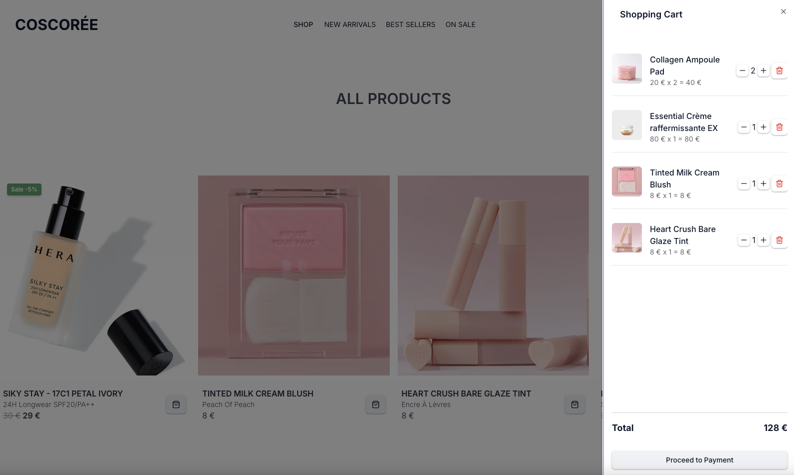
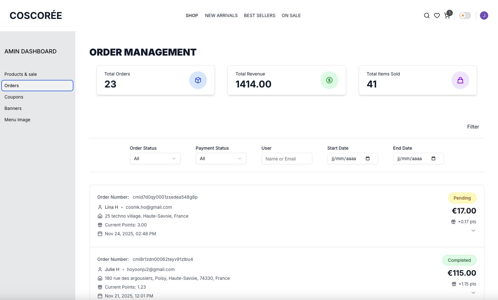
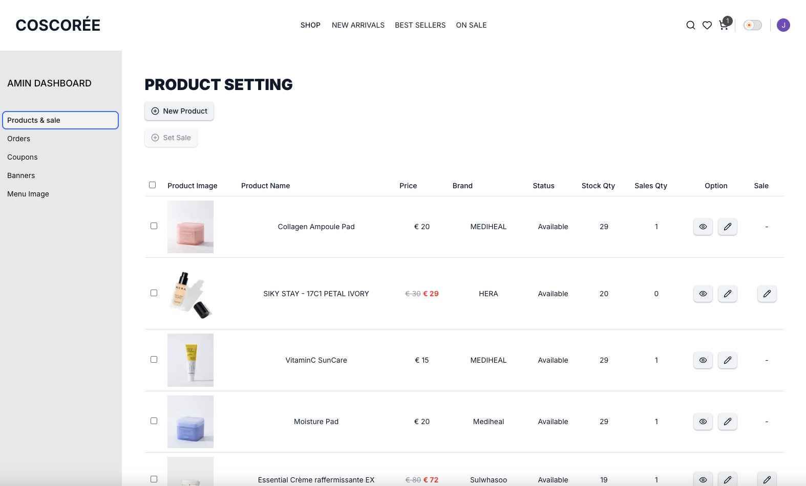
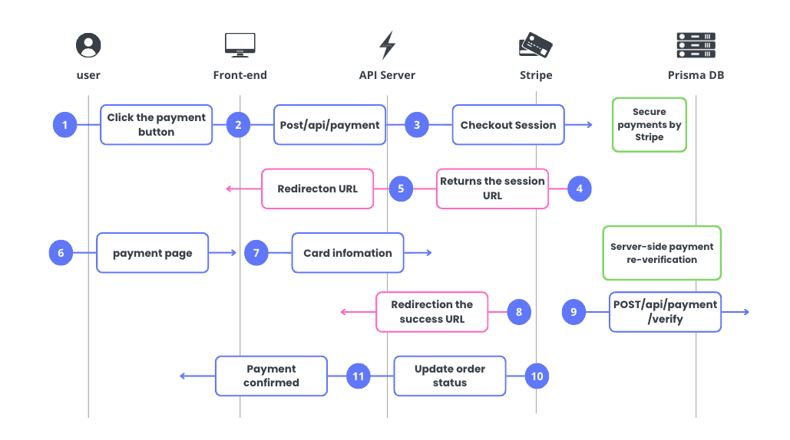

<div align="right">

🌐 **Languages**  
[🇫🇷 Français](./README.fr.md)| [🇰🇷 한국어](./README.ko.md)

</div>

# 🏪 Next.js E-Commerce Platform

> A Modern Full-Stack E-Commerce Platform - Real-World Project with Next.js 15, Firebase, and Prisma

---

## 🌐 Live Demo
Production Site: https://coscoree.vercel.app

---

## 🔐 Test Accounts

### **Admin Account**
- **Email:** hoyoonju2@gmail.com  
- **Password:** TestAdmin12*/

### **Standard User Account**
- **Email:** cosmk.ho@gmail.com  
- **Password:** TestUser88=*/  

---

## 💳 Stripe Test Payment

Use the following information for Stripe test mode:

- **Card Number:** 4242 4242 4242 4242  
- **Expiration Date:** Any future date  
- **CVC:** Any 3 digits  
- **Postal Code:** Any 5 digits  

---

## 📸 Screenshots

### **User Interface**

  
*Main home page*

  
*Product detail page*

  
*Shopping cart — real-time price calculation before checkout*

---

### **Admin Dashboard**

  
*Admin dashboard — Order list management*

  
*Admin dashboard — Product management*

  
*Admin dashboard — Banner image management*

---


## 📖 Project Overview

This project is designed as a **production-ready e-commerce website**.
Rather than a simple tech demo, it includes all core features required for real-world services: user authentication, product and inventory management, payment processing, and order management.
Through this project, I aimed to effectively demonstrate my full-stack web development capabilities and system design skills.

### 🎯 Project Goals

1. **Provide Complete E-Commerce Experience**
   - Implement the entire flow from product browsing, adding to cart, to completing actual payments

2. **Utilize Latest Tech Stack**
   - Apply modern React patterns using Next.js 15's App Router and Server Actions
   - Ensure type safety with TypeScript

3. **Scalable Architecture**
   - Hybrid database structure combining the strengths of Firebase and PostgreSQL
   - Improved maintainability through Separation of Concerns

4. **Production-Level Code Quality**
   - Production-ready code considering error handling, security, and performance optimization

---

## 🏗️ Architecture Design Philosophy

### Why This Structure?

#### 1️⃣ **Hybrid Database Strategy**


**Reasons for Choice:**
- **Firebase**: Fast read/write, real-time synchronization, easy file uploads (product images, etc.)
- **PostgreSQL + Prisma**: Complex relational data, ACID transaction guarantees (payments must never fail!)

#### 2️⃣ **Next.js 15 App Router + Server Actions**

**Reasons for Choice:**
- 🚀 **Performance**: Improved initial loading speed with Server Components (also beneficial for SEO)
- 🔒 **Security**: Process sensitive logic on the server (API keys, payment processing, etc.)
- 🎨 **Developer Experience**: Manage client/server code in a single file

```typescript
// Traditional approach: API Route + fetch
await fetch('/api/orders', { method: 'POST' })

// New approach: Server Action (simpler and type-safe!)
await createOrder(orderData)
```

#### 3️⃣ **Authentication: Firebase Auth + Session Cookies**

**Reasons for Choice:**
- Easy social login with Firebase Auth (Google, Email/Password)
- Securely check authentication status in Server Components with Session Cookies
- Prevent XSS attacks with `httpOnly` cookies

---

## ✨ Core Features

### 🛒 Shopping Experience

| Feature | Description | Technologies |
|---------|-------------|--------------|
| **Product Browsing** | Search, filtering, sorting | React Hook Form, Zod |
| **Shopping Cart** | Real-time quantity changes, price calculation | Firebase Firestore |
| **Review System** | Write, edit, delete reviews with real-time updates | Firebase |
| **Wishlist** | Add and remove favorite products | Firebase |
| **Coupon Application** | Apply discounts and verify usage | Firebase, Prisma |
| **Points Usage** | Use and earn points on orders | Prisma |
| **Product Search/Filter** | Category filters, product search | Firebase, client filter |

### 💳 Payment System
 


**Why Stripe?**
- 🌍 International standard payment solution
- 🔐 PCI-DSS compliant (card information never stored on our servers)
- 🧪 Developer-friendly (test mode, detailed documentation)

### 👨‍💼 Admin Features

| Feature | Description | Technologies |
|---------|-------------|--------------|
| **Product Management** | Create, update, delete products and upload images | Firebase, Next.js Server Actions |
| **Banner Management** | Add, delete, modify homepage banner images | Firebase Storage, Firestore |
| **Menu Image Management** | CRUD for category/menu images | Firebase |
| **Sale/Promotion Settings** | Set product sale status and manage sale prices | Firebase |
| **Coupon Management** | Register, delete, set periods, verify user usage | Firebase, Prisma |
| **Order Management** | View user order lists and update status | Prisma, Server Components |
| **Site Content Management** | Manage content displayed on home screen | Firebase |
| **Admin Dashboard** | Visualize sales, order volume, product statistics | Prisma, Server Components |

**Permission Management:**
```typescript
// Prisma Schema
model User {
  isAdmin Boolean @default(false)  // Admin flag
}
```

---

## 🔧 Technology Choices and Reasons

### Frontend

| Technology | Reason for Use |
|------------|----------------|
| **Tailwind CSS 4** | Fast UI development, consistent design system |
| **shadcn/ui (Radix UI-based)** | Accessible, styleable UI components with great UX |
| **React Hook Form** | Performance-optimized form management |
| **Zod** | Runtime type validation (both server/client) |

### Backend

| Technology | Reason for Use |
|------------|----------------|
| **Prisma** | Type-safe ORM, easy migrations |
| **Firebase Admin SDK** | Secure Firebase operations from server |
| **Next.js API Routes** | Manage full-stack in a single project |

---

## 🚀 Getting Started

### Prerequisites

- Node.js 18+
- PostgreSQL database
- Firebase project
- Stripe account

### Installation and Setup

```bash
# 1. Clone repository
git clone https://github.com/yoonju88/next_blog.git
cd next_blog

# 2. Install dependencies
npm install

# 3. Set up environment variables
cp .env.example .env.local

# 4. Run database migrations
npx prisma migrate dev

# 5. Start development server
npm run dev
```

---

## 📂 Project Structure

```
next_blog/
├── app/                                   # Next.js App Router
│   ├── (auth)/                            # Login, signup, password reset
│   ├── (shop)/                            # Shopping pages (product list, details)
│   ├── account/                           # User account pages
│   ├── admin/                             # Admin pages (product/banner/menu management)
│   └── api/                               # API Routes
│       ├── payment/                       # Payment-related APIs
│       └── cart/                          # Cart-related APIs
│
├── components/                            # React components
│   ├── ui/                                # shadcn/ui-based shared UI
│   └── admin/                             # Admin-specific components
│
├── context/                               # Global state management (Context API)
│   ├── AuthContext.tsx                    # Authentication state
│   ├── CartContext.tsx                    # Shopping cart state
│   └── FilterContext.tsx                  # Search/filter state
│
├── data/                                  # Static data, options, dummy data
├── docs/                                  # Documentation images, diagrams
│   └── Datastructure.png                  # DB structure/architecture images
│
├── firebase/                              # Firebase configuration
│   ├── client.ts                          # Firebase Client SDK
│   └── server.ts                          # Firebase Admin SDK
│
├── function/                              # Server-side utility functions, service layer
├── generated/                             # Prisma / auto-generated files
│
├── hooks/                                 # Custom hooks
│   ├── use-mobile.ts                      # Mobile detection hook
│   └── useUserPoints.ts                   # User points hook
│
├── lib/                                   # API, auth, service layer utilities
│   ├── auth/                              # Authentication service functions
│   ├── user/                              # User-related service functions
│   └── prisma.ts                          # Prisma client creation
│
├── prisma/                                # Prisma ORM configuration
│   └── schema.prisma                      # DB schema definition
│
├── public/                                # Static files (images, icons)
├── scripts/                               # Build/deploy/dev scripts
├── types/                                 # TypeScript global types
├── utils/                                 # Pure utility functions
├── validation/                            # Zod-based input validation schemas
│
├── package.json
├── tsconfig.json
└── README.md (EN, KR, FR)
```

---

## 💡 Key Learnings

### 1. **Why Use Prisma and Firebase Together?**

In e-commerce services, different types of data require different levels of performance and reliability.
Using a single database for all data can lead to inefficiencies.

The reason for using Firebase and PostgreSQL together is to leverage each one's strengths precisely.
By choosing the optimal storage based on data characteristics, I used Firebase (real-time/flexibility) + PostgreSQL (consistency/transactions).

# 🔥 Firebase (NoSQL)

- Real-time updates
- Fast queries
- Flexible structure
- Ideal for user experience-focused data

Optimized for rapidly changing data requiring real-time responses,
so UI-centric data like shopping carts, reviews, likes, product info, promotional images, and user data
are much more efficient with Firebase.

# 🧊 PostgreSQL (SQL)

- ACID transactions
- Relational structure
- Handles sensitive information like payments, orders, points

Suitable for critical data where accuracy and stability are paramount,
so core business logic data like orders, payments, inventory, coupons, and points
are safer with PostgreSQL.

### 2. **The True Value of Server Actions**

```typescript
// Before: Complex API Route + fetch
const response = await fetch('/api/orders', {
  method: 'POST',
  headers: { 'Content-Type': 'application/json' },
  body: JSON.stringify(data)
})
const result = await response.json()

// After: Simple Server Action
const result = await createOrder(data)
```

**Lesson:**
- Server Actions are much more efficient for simple tasks
- Type safety is automatically ensured

### 3. **Challenges of Implementing Payment Systems**

The payment functionality is the most sensitive area of the entire service and must never fail.
That's why I was particularly careful during implementation.

- Used Prisma transactions to ensure data consistency between orders and payments
- Plan to implement additional server-side verification through Stripe Webhooks to confirm actual payment completion
- Carefully designed error handling flows to prepare for unexpected issues
  - Re-verify Stripe payments on the server
  - Bundle orders, payments, and inventory in transactions so everything rolls back if anything fails
  - Plan to add safeguards against duplicate webhook calls or Stripe API errors

**Lesson:**
- Test money-related features dozens of times
- Consider all edge cases

---

## 🐛 Troubleshooting Experience

### Issue 1: Prisma Client Initialization Error

```
Error: @prisma/client did not initialize yet
```

**Cause:** Conflict with Next.js 15's webpack bundling system

**Solution:**
```typescript
// next.config.ts
export default {
  serverExternalPackages: ['@prisma/client', 'prisma']
}
```

### Issue 2: Cart Not Clearing After Payment

**Cause:** Misunderstanding of Firestore data structure as subcollections

**Solution:** 
- Actual structure is `users/{uid}/cart: []` (array field)
- Direct update with `update({ cart: [] })`

**Lesson:** Clearly understand and document data structures!

---

## 🔜 Future Plans

- [ ] 💌 Email notification system (order confirmation, shipping alerts)
- [ ] ✉️ Build contact/inquiry email system
- [ ] 🔔 Complete Stripe Webhook integration
- [ ] 📊 Advanced admin statistics dashboard with data insights
- [ ] 🤖 AI-based automatic data generation (product metadata, summaries, etc.)
- [ ] 📱 Responsive design improvements
- [ ] 🧪 Introduce automated testing (Playwright E2E tests + Jest unit tests)

---

## 📄 License

This project is under the MIT License.
This license is a very flexible open-source license that allows free use, copying, modification, and distribution of the software.
Copyright (c) 2025 TERRENOIRE HO Yoonju

---

## 🙏 References

- [Next.js 15 Documentation](https://nextjs.org/docs)
- [Prisma Documentation](https://www.prisma.io/docs)
- [Stripe Checkout Documentation](https://stripe.com/docs/payments/checkout)
- [Firebase Documentation](https://firebase.google.com/docs)
- [Tailwind CSS Documentation](https://tailwindcss.com/docs)
- [shadcn/ui Documentation](https://ui.shadcn.com/)
---

## 📧 Contact

If you have questions or suggestions about the project, please open an issue!

---

**⭐ If this project was helpful, please give it a star!**