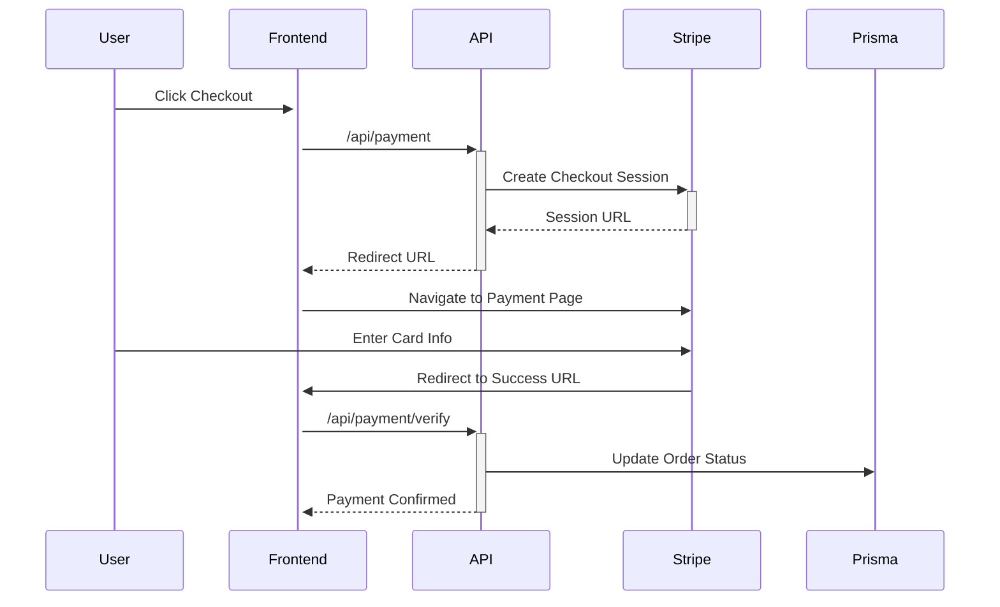

<div align="right">

🌐 **Languages**  
[🇺🇸 English](./README.md) | [🇰🇷 한국어](./README.ko.md)

</div>

# 🏪 Next.js E-Commerce Platform

> Modern Full-Stack E-Commerce Platform - Real-world Project with Next.js 15, Firebase, and Prisma

---

## 📖 Project Overview

This project was initiated to build a **production-ready e-commerce website**. Beyond a simple blog or portfolio, it implements all core features required for a real business: user authentication, product management, payment processing, and order management.

### 🎯 Project Goals

1. **Complete E-Commerce Experience**
   - Implement the entire flow where customers can browse products, add to cart, and complete actual purchases

2. **Utilize Latest Tech Stack**
   - Apply modern React patterns using Next.js 15's App Router and Server Actions
   - Ensure type safety with TypeScript

3. **Scalable Architecture**
   - Hybrid database structure combining the strengths of Firebase and PostgreSQL
   - Enhanced maintainability through Separation of Concerns

4. **Production-Level Code Quality**
   - Production-ready code considering error handling, security, and performance optimization

---

## 🏗️ Architecture Design Philosophy

### Why This Architecture?

#### 1️⃣ **Hybrid Database Strategy**

```
Firebase (NoSQL)          +          PostgreSQL (SQL)
    ↓                                      ↓
Real-time Critical Data             Transaction Critical Data
- Product Information                - Order Records
- User Profiles                      - Payment Information
- Shopping Cart                      - Inventory Management
```

**Rationale:**
- **Firebase**: Fast read/write, real-time sync, easy file uploads (product images, etc.)
- **PostgreSQL + Prisma**: Complex relational data, ACID transaction guarantees (payments must never fail!)

#### 2️⃣ **Next.js 15 App Router + Server Actions**

**Rationale:**
- 🚀 **Performance**: Improved initial loading speed with Server Components (SEO friendly)
- 🔒 **Security**: Handle sensitive logic on the server (API keys, payment processing, etc.)
- 🎨 **Developer Experience**: Manage client/server code in a single file

```typescript
// Old Way: API Route + fetch
await fetch('/api/orders', { method: 'POST' })

// New Way: Server Action (Simpler and type-safe!)
await createOrder(orderData)
```

#### 3️⃣ **Authentication: Firebase Auth + Session Cookies**

**Rationale:**
- Easy social login with Firebase Auth (Google, Email/Password)
- Safely check authentication state in Server Components with Session Cookies
- Prevent XSS attacks with `httpOnly` cookies

---

## ✨ Key Features

### 🛒 Shopping Experience

| Feature | Description | Technology |
|---------|-------------|------------|
| **Product Browse** | Search, filtering, sorting | React Hook Form, Zod |
| **Shopping Cart** | Real-time quantity changes, price calculation | Firebase Firestore |
| **Coupons & Points** | Apply discounts, use points | Prisma |
| **Review System** | Ratings and reviews | Firebase |

### 💳 Payment System



**Why Stripe?**
- 🌍 International standard payment solution
- 🔐 PCI-DSS compliant (card info never stored on our server)
- 🧪 Developer-friendly (test mode, detailed documentation)

### 👨‍💼 Admin Features

- **Product Management**: CRUD operations, image uploads
- **Order Management**: View all orders, filtering, status updates
- **Coupon Management**: Create and manage discount coupons
- **Dashboard**: Sales statistics, recent order status

**Permission Management:**
```typescript
// Prisma Schema
model User {
  isAdmin Boolean @default(false)  // Admin flag
}
```

---

## 🔧 Technology Choices Rationale

### Frontend

| Technology | Rationale |
|------------|-----------|
| **Tailwind CSS 4** | Rapid UI development, consistent design system |
| **Radix UI** | Accessible headless components |
| **React Hook Form** | Performance-optimized form management |
| **Zod** | Runtime type validation (both server/client) |

### Backend

| Technology | Rationale |
|------------|-----------|
| **Prisma** | Type-safe ORM, easy migrations |
| **Firebase Admin SDK** | Safe Firebase operations on server |
| **Next.js API Routes** | Manage full-stack in a single project |

---

## 🚀 Getting Started

### Prerequisites

- Node.js 18+
- PostgreSQL database
- Firebase project
- Stripe account

### Installation and Setup

```bash
# 1. Clone repository
git clone https://github.com/yoonju88/next_blog.git
cd next_blog

# 2. Install dependencies
npm install

# 3. Configure environment variables
cp .env.example .env.local
# Open .env.local and enter required keys

# 4. Database migration
npx prisma migrate dev

# 5. Run development server
npm run dev
```

Open http://localhost:3000 in your browser!

---

## 📂 Project Structure

```
next_blog/
├── app/                          # Next.js App Router
│   ├── (auth)/                   # Authentication pages
│   ├── (shop)/                   # Shopping pages
│   ├── account/                  # My page
│   ├── admin/                    # Admin pages
│   └── api/                      # API Routes
│       ├── payment/              # Payment API
│       └── cart/                 # Cart API
├── components/                   # React components
│   ├── ui/                       # Reusable UI components
│   └── admin/                    # Admin-only components
├── context/                      # React Context
│   ├── AuthContext.tsx           # Authentication state
│   ├── CartContext.tsx           # Cart state
│   └── FilterContext.tsx         # Filter state
├── lib/                          # Utility functions
│   ├── auth/                     # Authentication related
│   ├── user/                     # User related
│   └── prisma.ts                 # Prisma client
├── prisma/                       # Prisma configuration
│   └── schema.prisma             # Database schema
├── firebase/                     # Firebase configuration
│   ├── client.ts                 # Client SDK
│   └── server.ts                 # Admin SDK
└── types/                        # TypeScript type definitions
```

---

## 💡 Lessons Learned

### 1. **Using Prisma and Firebase Together**

Initially, I thought "Why use two databases?" but leveraging the strengths of each was much more efficient.

**Lesson:**
- Don't try to put all data in one DB
- Choose the right storage for data characteristics

### 2. **The True Value of Server Actions**

```typescript
// Before: Complex API Route + fetch
const response = await fetch('/api/orders', {
  method: 'POST',
  headers: { 'Content-Type': 'application/json' },
  body: JSON.stringify(data)
})
const result = await response.json()

// After: Simple Server Action
const result = await createOrder(data)
```

**Lesson:**
- Server Actions are much more efficient for simple tasks
- Type safety is automatically ensured

### 3. **Challenges of Payment System Implementation**

Payment is a critical feature that must never fail. To ensure this:

- ✅ Data integrity guaranteed with Prisma transactions
- ✅ Payment verification with Stripe Webhook (to be implemented)
- ✅ Thorough error handling

**Lesson:**
- Test money-related features dozens of times
- Consider all edge cases

---

## 🐛 Troubleshooting Experience

### Issue 1: Prisma Client Initialization Error

```
Error: @prisma/client did not initialize yet
```

**Cause:** Conflict with Next.js 15's webpack bundling system

**Solution:**
```typescript
// next.config.ts
export default {
  serverExternalPackages: ['@prisma/client', 'prisma']
}
```

### Issue 2: Cart Not Clearing After Payment

**Cause:** Misunderstood Firestore data structure as subcollection

**Solution:** 
- Actual structure is `users/{uid}/cart: []` (array field)
- Direct update with `update({ cart: [] })`

**Lesson:** Clearly understand and document data structures!

---

## 🔜 Future Plans

- [ ] 💌 Email notification system (order confirmation, shipping alerts)
- [ ] 🔔 Complete Stripe Webhook integration
- [ ] 📊 More detailed admin statistics dashboard
- [ ] 🌍 Multi-language support (i18n)
- [ ] 📱 Responsive design improvements
- [ ] 🧪 E2E testing (Playwright)

---

## 📄 License

This project is under the MIT License.

---

## 🙏 References

- [Next.js 15 Documentation](https://nextjs.org/docs)
- [Prisma Documentation](https://www.prisma.io/docs)
- [Stripe Checkout Documentation](https://stripe.com/docs/payments/checkout)
- [Firebase Documentation](https://firebase.google.com/docs)

---

## 📧 Contact

If you have questions or suggestions about this project, please open an issue!

---

**⭐ If this project helped you, please give it a star!**